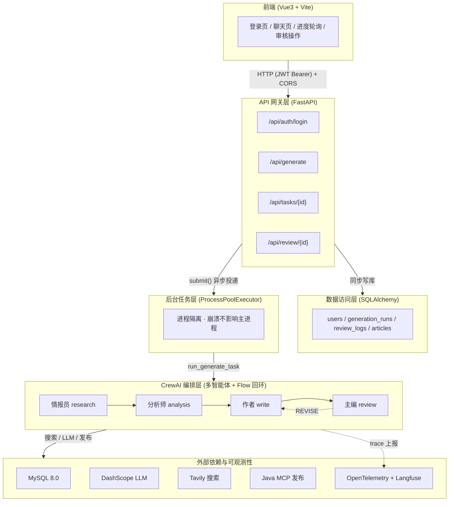
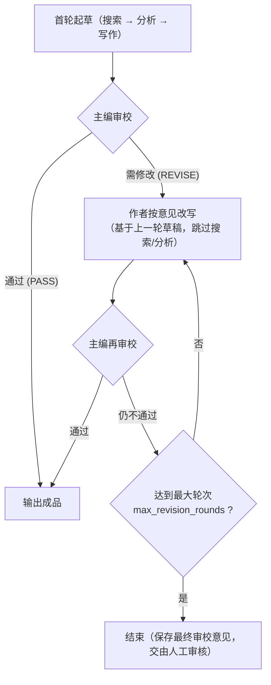
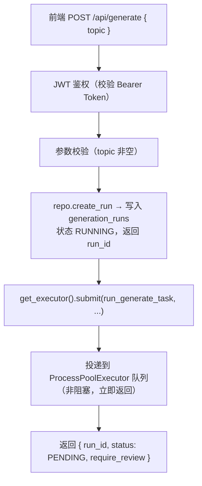
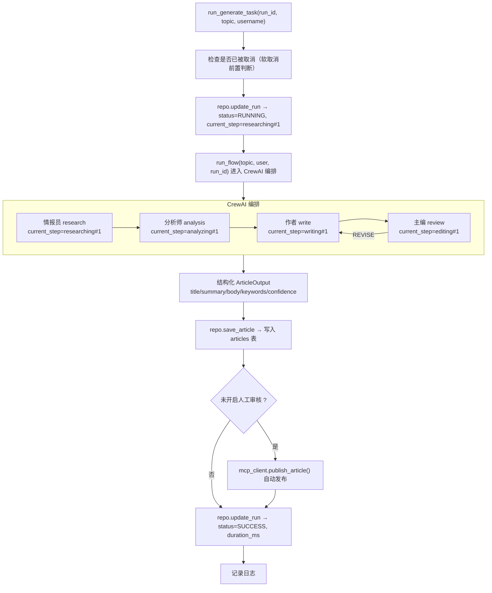
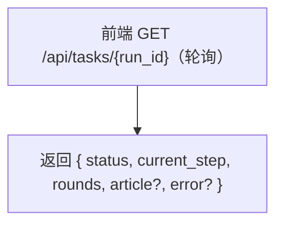
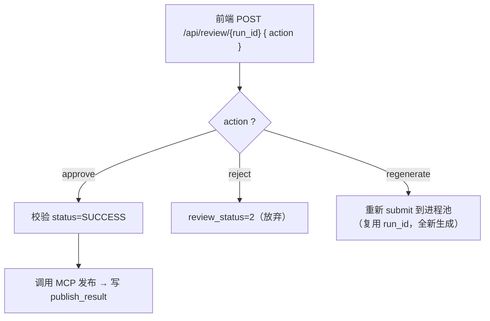
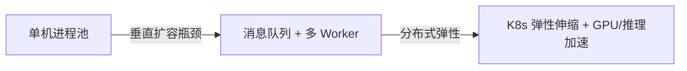

# 技术自媒体编辑部 Agent（CrewAI 多智能体内容生产系统）

基于 **CrewAI** 的多 Agent 编辑部：情报员 → 分析师 → 作者 → 主编，内置「写 → 审 → 改」自动化回环与人工审核门禁，用于技术类媒体文章的**端到端自动化生产**。后端采用 **FastAPI + MySQL + 进程池异步任务**，前端采用 **Vue3 + Vite**，支持 Docker 容器化部署。

> 关键词：CrewAI 多智能体编排 / 异步任务队列（进程池）/ 结构化输出 / 断点续跑 / 人工审核门禁 / 可观测性（OpenTelemetry + Langfuse）/ Docker Compose 部署

---

## 目录

- [一、项目技术架构](#一项目技术架构)
- [二、整体工作流程](#二整体工作流程)
- [三、一个请求的详细执行流程](#三一个请求的详细执行流程)
- [四、本地运行](#四本地运行)
- [五、Docker 环境部署](#五docker-环境部署)
- [六、高并发瓶颈分析与调优思路](#六高并发瓶颈分析与调优思路)
- [七、项目扩展点](#七项目扩展点)
- [八、目录结构](#八目录结构)

---

## 一、项目技术架构

### 1.1 总体分层



### 1.2 技术选型

| 层 | 技术 | 说明 |
|---|---|---|
| Web 框架 | FastAPI + Uvicorn | 异步高性能，自带 OpenAPI 文档 |
| 智能体编排 | CrewAI (Flow + Agent/Task) | 多智能体协作 + 有状态回环 |
| 异步任务 | `ProcessPoolExecutor` | 进程隔离承载长耗时 LLM 任务 |
| ORM | SQLAlchemy 2.0 | 声明式模型，连接池管理 |
| 数据库 | MySQL 8.0 | 业务持久化 |
| 认证 | JWT (python-jose) | 无状态鉴权 |
| 配置管理 | pydantic-settings | `.env` 环境变量集中管理 |
| 可观测性 | OpenTelemetry + OpenLIT + Langfuse | LLM 调用 trace 自动上报 |
| 结构化输出 | Pydantic | 模型输出强约束与容错解析 |
| 部署 | Docker + Docker Compose | 后端 + MySQL 一键编排 |

### 1.3 关键设计决策

1. **进程池而非线程池**：CrewAI 多 Agent 编排混合了模型 IO 与大量 Python 同步计算（prompt 拼接、结果解析、工具调度），受 GIL 影响线程无法真正并行；且子进程崩溃不会拖垮主进程（隔离性）。这是与"普通 Web 请求用线程池"的本质区别。
2. **进程池大小不按 CPU 核数**：每个任务常驻几十秒~几分钟，进程数由"下游 LLM 限流 / MySQL 连接数 / 内存"共同约束，而非核数。默认 `min(核数, 4)`，可配置。
3. **任务级状态机**：`PENDING → RUNNING → SUCCESS / FAILED / CANCELLED`，通过轮询接口向前端实时反馈进度。
4. **软取消**：CrewAI 子进程内的模型调用无法被真正强制中断，采用"标记 CANCELLED + 子进程跑完后检测状态不再覆盖"的软取消策略。

---

## 二、整体工作流程

### 2.1 智能体角色与职责

| 智能体 | 职责 | 工具 |
|---|---|---|
| 情报员 (Researcher) | 围绕主题搜索、收集信息 | Tavily 搜索 |
| 分析师 (Analyst) | 对调研结果分析、提炼要点 | 当前时间工具 |
| 作者 (Writer) | 按分析结果撰写文章 | 当前时间工具 |
| 主编 (Editor) | 审校草稿、给出修改意见 | 当前时间工具（专用模型） |

### 2.2 「写 → 审 → 改」回环



- 回环通过 CrewAI **Flow** 实现（`draft → review → maybe_revise`）。
- 每轮重写**基于上一轮草稿 + 主编意见**定向修改，而非从头开始（保证审校有意义）。
- `max_revision_rounds` 兜底，防止无限循环。

### 2.3 人工审核门禁（可选）

生成完成后，可通过 `REQUIRE_HUMAN_REVIEW` 开关决定：

- **开启（默认）**：文章不自动发布，进入人工审核（通过 `approve` / 放弃 `reject` / 重新生成 `regenerate`）。
- **关闭**：生成成功即自动调用 MCP 发布。

---

## 三、一个请求的详细执行流程

以「前端发起文章生成」为例，完整链路如下：

### 阶段 1：请求接入（同步，毫秒级返回）



**设计要点**：`/api/generate` 只做「落库 + 投递任务」，**立即返回 run_id**，不阻塞等待 LLM 结果。前端拿到 run_id 后轮询进度。这是典型的**异步任务解耦**模式，避免 HTTP 长连接被 LLM 长耗时任务占满。

### 阶段 2：后台进程池执行（异步，几十秒~几分钟）

子进程执行 `run_generate_task`：



### 阶段 3：进度轮询（前端拉取）



- 子进程每执行一个步骤就回写 `current_step`（如 `researching#1`、`writing#2`），前端据此展示实时进度。
- `SUCCESS` 时返回完整结构化文章。

### 阶段 4：人工审核与发布



### 关键机制说明

| 机制 | 说明 |
|---|---|
| **进程隔离** | 每个任务在独立子进程跑，崩溃不影响主进程与其他任务 |
| **进度回写** | 手动 `task.execute_sync()` 按序执行，在每步前回写 `current_step`，比 `crew.kickoff()` 回调更可靠 |
| **结构化输出容错** | LLM 输出 JSON 可能被代码块包裹或截断，用「代码块剥离 → 整段解析 → 截取 `{}` → 正则兜底」多级容错 |
| **断点续跑** | `retry` 接口复用已有草稿，跳过搜索/分析直接改写，节省成本 |
| **幂等发布** | `articles.run_id` 唯一索引，重新生成时更新而非重复插入 |

---

## 四、本地运行

### 4.1 环境准备

- Python 3.11+
- Node.js 18+
- MySQL 8.0

### 4.2 后端

```bash
cd backend
pip install -r requirements.txt

# 配置 .env（见下）
# 启动（启动时自动建表 + 插入默认账号 + 预热进程池）
python -m app.main
```

Swagger 文档：http://localhost:8000/docs

### 4.3 前端

```bash
cd frontend
npm install
npm run dev
```

浏览器访问 http://localhost:5173 ，用默认账号登录。

> vite 已配置 `/api` 代理到 `http://localhost:8000`，前后端分离开发无需关心跨域。

### 4.4 `.env` 配置项

| 变量 | 说明 |
|---|---|
| `MODEL_NAME` / `DASHSCOPE_API_KEY` / `DASHSCOPE_BASE_URL` | 主模型（DashScope 兼容 OpenAI 接口） |
| `EDITOR_MODEL_NAME` 等 | 主编专用模型（不填则回退主模型） |
| `TAVILY_API_KEY` | 搜索工具 |
| `DB_HOST` / `DB_PORT` / `DB_USER` / `DB_PASSWORD` / `DB_NAME` | MySQL 连接 |
| `LANGFUSE_*` / `CREWAI_API_KEY` | 可观测性（可留空降级为本地日志） |
| `JWT_SECRET` / `JWT_EXPIRE_MINUTES` | 鉴权 |
| `MCP_BASE_URL` / `MCP_AUTH_TOKEN` | 发布服务（Java Spring AI MCP） |
| `REQUIRE_HUMAN_REVIEW` | 是否开启人工审核 |
| `DEFAULT_USERNAME` / `DEFAULT_PASSWORD` | 启动时插入的默认账号 |
| `WORKER_PROCESSES` | 后台进程池大小（0=自动，上限 8） |

---

## 五、Docker 环境部署

### 5.1 构建镜像（构建与运行分离）

先手动构建后端镜像（与运行解耦，构建失败不阻塞部署）：

```bash
cd backend
docker build -f Dockerfile -t crewai-backend:v1.0.0 .
```

> 说明：
> - 构建上下文为 `backend/` 目录。
> - pip 使用阿里云镜像源，apt 已切换国内 Debian 源。
> - 依赖均为预编译 wheel，无需 gcc 工具链。

### 5.2 启动服务

```bash
cd ..   # 回到项目根目录
docker compose up -d
```

`docker-compose.yml` 编排了 `backend` + `mysql` 两个服务：

- **mysql**：`mysql/mysql-server:8.0`，数据持久化到命名卷 `mysql_data`，端口 3306。
- **backend**：引用已构建的 `crewai-backend:v1.0.0` 镜像，通过 service 名 `mysql` 连接数据库，端口 8000。

### 5.3 常用运维命令

```bash
# 查看日志
docker compose logs -f backend

# 查看状态
docker compose ps

# 停止
docker compose down

# 修改 .env 后重启（无需重新打包镜像）
docker compose up -d
# 若环境变量未自动生效，强制重建
docker compose up -d --force-recreate backend

# 查看 MySQL 日志
docker compose logs -f mysql
```

### 5.4 注意事项

1. **`.env` 修改无需重新打包镜像**：配置通过环境变量在容器启动时注入，镜像内不含 `.env`。
2. **DB_HOST 用 service 名 `mysql`**：容器内 `localhost` 指向容器自身，不能连到 MySQL 容器。
3. **MCP 服务地址**：若 MCP 部署在宿主机（非容器），需用宿主机 IP（如 `http://<host-ip>:8080/mcp/message`），而非 `localhost`。

---

## 六、高并发瓶颈分析与调优思路

### 6.1 潜在瓶颈点

| 瓶颈 | 原因 | 表现 |
|---|---|---|
| **LLM 调用延迟** | 单任务多智能体串行调用，每轮几十秒~几分钟 | 任务积压，P90 延迟高 |
| **进程池容量** | `ProcessPoolExecutor` 进程数有限 | 任务排队等待，吞吐量上不去 |
| **LLM 供应商限流** | DashScope 有 RPM/TPM 配额 | 并发任务互相抢额度，触发限流报错 |
| **MySQL 连接数** | 进程数 × 每任务 DB 连接，易触达 `max_connections` | 获取连接失败 |
| **内存** | 每个 CrewAI 子进程吃几百 MB~GB | 进程 OOM（exit 137） |
| **轮询风暴** | 前端高频轮询 `/api/tasks/{id}` | 数据库读压力 |

### 6.2 调优思路

1. **进程池调优**：`WORKER_PROCESSES` 不按核数，按「下游限额 / 内存 / MySQL 连接」综合定，一般 2~8。核心公式：
   ```
   总连接数 ≈ 进程数 × 单任务 DB 连接数  <  MySQL max_connections
   总 LLM 并发 ≈ 进程数 × 单任务调用并发 <  供应商 RPM/TPM 限额
   ```
2. **任务队列化**：当前 `submit()` 直接进进程池队列，高并发时可用独立消息队列（Celery + Redis/RabbitMQ）做削峰、重试、持久化，详见 [7.1 任务调度：进程池 vs 独立消息队列](#71-任务调度进程池-vs-独立消息队列面试高频)。
3. **缓存热点**：对同一主题的搜索结果、已生成文章做缓存，减少重复 LLM 调用。
4. **流式输出**：长文生成可改为 SSE/WebSocket 流式返回，改善用户体验。
5. **连接池调优**：数据库连接池 `pool_size`/`max_overflow` 配合进程数设置，避免连接耗尽。
6. **降级与限流**：进程池满时对 `/api/generate` 做限流（如信号量/令牌桶），返回友好提示而非无限排队。
7. **可观测性驱动**：通过 Langfuse 定位每步耗时，识别是搜索慢、LLM 慢还是 DB 慢，针对性优化。

### 6.3 扩展性架构演进方向



---

## 七、项目扩展点

| 扩展点 | 说明 |
|---|---|
| **多工具接入** | 内部知识库 RAG、网页抓取、图片生成等多工具组合 |
| **更多智能体角色** | 合规审查 Agent、多语种翻译 Agent、标题党检测 Agent |
| **流式输出** | SSE/WebSocket 实时推送生成过程 |
| **成本看板** | 统计 token 消耗、单篇成本、模型调用次数 |
| **批量并发** | 批量主题提交、任务优先级调度 |
| **消息队列化** | 用 Celery/RQ/Redis/RabbitMQ 替换进程池，支持持久化任务与分布式 worker。见下方详述 |
| **向量检索** | 历史文章向量化，做相似度检索与去重 |
| **A/B 测试** | 不同模型/参数的效果对比 |

### 7.1 任务调度：进程池 vs 独立消息队列

> 常见误区："投递到队列是不是比进程池效果更好？"——需要先澄清概念。

**进程池本身就是队列**：`ProcessPoolExecutor.submit()` 的内部实现就是把任务放进一个内部队列，空闲 worker 进程从队列取任务执行。因此"队列"和"进程池"不是非此即彼，进程池 = 队列 + 进程管理。通常指的"独立队列"是 **Redis / RabbitMQ / Celery / 数据库队列表** 这类中间件，执行方仍是进程池。

**两种方案的本质差异**：

| 维度 | 现状：Web 进程内 ProcessPoolExecutor | 独立消息队列（如 DB 队列表 / Redis + 进程池消费者） |
|---|---|---|
| 任务持久化 | 无。Web 进程重启/崩溃，未跑任务**全丢** | 有。任务落库，进程挂了重启后继续消费 |
| 跨进程/多实例 | 每个实例各自一个池，任务绑定提交它的实例 | 任意实例均可消费，天然支持水平扩展 |
| 背压 / 削峰 | 有限。池满后内部队列持续堆积，内存暴涨才阻塞 | 队列可设上限，超量直接拒绝或排队，保护系统 |
| 任务状态查询 | 仅能靠 `review_logs` 反查 | 队列自带 pending/running/done 状态，更标准 |
| 实时进度回写 | task 执行时直接 `repo.update_run_current_step` | 同样可做，无差别 |
| 复杂度 / 运维 | 低，零额外组件 | 高，多一个中间件需保障高可用 |
| 吞吐上限 | 由 worker 进程数决定 | 同左（队列只管排，不增吞吐） |

**何时该上独立队列**：
- 要求任务**不丢**（Web 重启/发版热更时，正在排队/运行的生成任务不再消失）；
- 需要**多 backend 副本**横向扩展，任务在实例间共享；
- 高并发下需要**削峰 + 限流**保护下游 LLM/MySQL。

**最小演进方案（零新依赖）**：复用现有 MySQL，加一张 `task_queue` 表，消费方改为常驻协程/线程从表取 `pending` 任务再投递进程池执行。既保留进程池隔离优点，又补上持久化 + 可查询 + 重启不丢，无需引入 Redis。

**本项目的取舍**：当前为单机展示场景，任务偶发丢失可接受，进程池零运维成本更合适；引入 Redis 反而增加部署复杂度。后续若要上生产，按上表渐进演进即可。

---

## 八、目录结构

```
CrewAIDemo/
├── backend/                      # 后端（FastAPI + CrewAI）
│   ├── Dockerfile                # 后端镜像构建
│   ├── .dockerignore
│   ├── requirements.txt
│   └── app/
│       ├── main.py               # FastAPI 入口（lifespan 初始化）
│       ├── config/               # 配置（settings.py + agents.yaml + tasks.yaml）
│       ├── crew/                 # CrewAI 编排（多智能体 + Flow 回环）
│       ├── api/                  # 路由（auth 登录 / chat 生成与审核）
│       ├── db/                   # SQLAlchemy 模型、仓储层、初始化
│       ├── worker/               # 后台进程池（pool.py + tasks.py）
│       ├── observability/        # OTel / Langfuse / 本地日志
│       └── util/                 # 日志、MCP 客户端、工具函数
├── frontend/                     # 前端（Vue3 + Vite）
├── docker-compose.yml            # backend + MySQL 编排
└── .env                          # 密钥与连接配置（不入库、不打镜像）
```

---

## 已落地的核心能力

- 多智能体编排（情报员 → 分析师 → 作者 → 主编）
- 「写 → 审 → 改」自动回环 + 最大轮次守卫
- 结构化输出（Pydantic）+ 多级容错解析
- 异步任务（进程池）+ 任务状态机 + 进度实时回写
- 断点续跑 / 软取消 / 重新生成
- 人工审核门禁 + MCP 自动发布
- LLM 调用重试（指数退避）
- 可观测性（OpenTelemetry + Langfuse，本地日志降级）
- JWT 鉴权 + 默认账号初始化
- Docker Compose 一键部署（后端 + MySQL）
